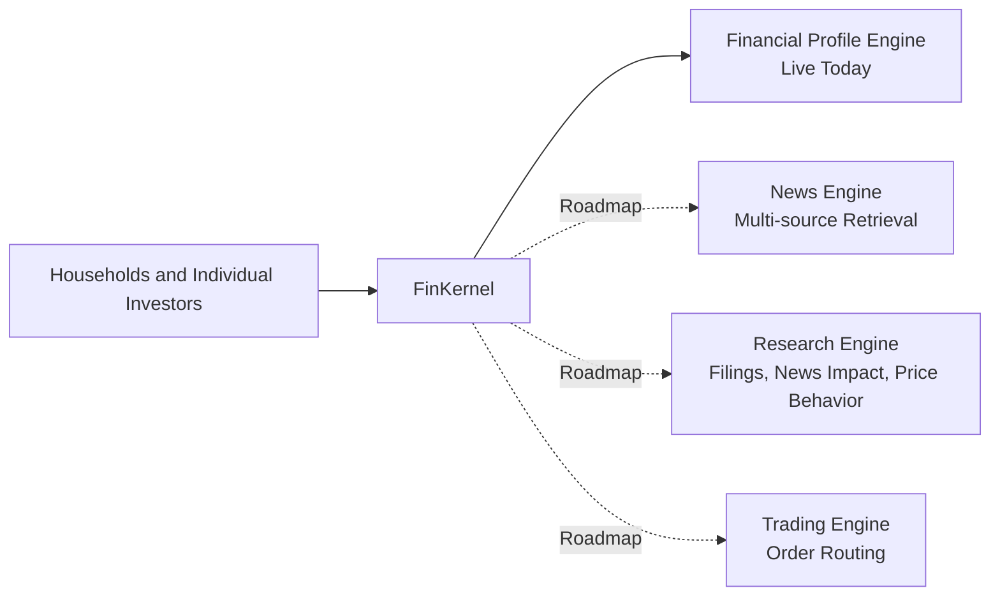
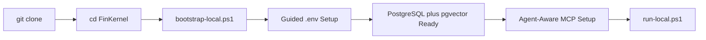

# FinKernel

[](README.en.md)
[](README.zh-CN.md)


FinKernel is an AI-native financial infrastructure project designed to lower the barrier to family-office-grade workflows. Our goal is simple: give every household and every ordinary investor access to better financial context, better tooling, and better decision support.

Today, most family office capability is still gated by high minimum assets, fragmented tooling, and heavy manual coordination. FinKernel aims to change that by turning financial context, analysis, and execution infrastructure into a developer- and agent-friendly kernel.

## Background

Traditional family office services sit behind high entry thresholds. That leaves most families with scattered data, generic advice, and limited decision support.

FinKernel is built on a different premise:

- AI should be able to gather financial context more reliably
- financial tools should be easier to integrate into one coherent system
- high-quality financial workflows should not be reserved for ultra-high-net-worth users

We want the capabilities of a modern family office to become accessible to every family and every individual user.

## Mission

FinKernel integrates financial tools so AI systems can:

- retrieve the right information at the right moment
- form better advice with structured context instead of generic chat
- assist human decision-making with clearer research, better memory, and safer operational flows

The long-term vision is not just "finance chat". It is a composable operating layer for AI-assisted financial understanding, recommendation support, and eventually execution.

## Platform Map



## Coverage

The product vision spans several major framework layers. Only the financial profile engine is live in the current main path.

| Framework | What it is for | Typical outcomes | Status |
| --- | --- | --- | --- |
| Financial Profile Engine | Build a durable investor persona with risk preferences, constraints, memories, and human-readable markdown | `assess_persona`, risk summary, versioned persona updates |  |
| News Engine | Collect and normalize news from multiple financial sources for AI retrieval | market-moving event collection, source-aware summaries, watchlists |  |
| Research Engine | Analyze earnings, filings, news impact, and price behavior | report digestion, event impact analysis, narrative plus signal synthesis |  |
| Trading Engine | Route and manage trading orders through integrated brokers and execution layers | order routing, approval flows, execution support |  |

### Current delivery scope

Phase 1 is the personal risk profile foundation.

In the current codebase, FinKernel focuses on:

- profile onboarding
- guided risk-profile discovery
- profile review and versioning
- persona markdown authoring
- long-term and short-term memory capture
- MCP + HTTP access for host agents

Everything else remains roadmap material for now, and should be communicated that way.

## Install

### Fastest path

```powershell
git clone https://github.com/JiwenS/FinKernel.git
cd FinKernel
powershell -ExecutionPolicy Bypass -File .\scripts\bootstrap-local.ps1
```

That bootstrap flow is designed to feel like a guided installer, not a raw script. It will:

- create `.venv`
- install dependencies
- walk through `.env` setup one field at a time
- initialize PostgreSQL and enable `vector`
- create local MCP configs
- prioritize four first-class host agents: `Codex`, `Claude Code`, `OpenClaw`, and `Hermes`
- install a FinKernel skill bundle into the selected agent's native skills directory
- attempt agent-specific MCP registration when the corresponding CLI is available
- fall back to a `Custom MCP client` export path for every other host runtime

### Bring the project up

```powershell
powershell -ExecutionPolicy Bypass -File .\scripts\run-local.ps1
```

Health check:

```text
GET http://localhost:8000/api/health
```

MCP endpoint:

```text
http://localhost:8000/api/mcp/
```

### Setup flow



For deeper setup details, see:

- `../setup-and-run.md`
- `../host-agent-runtime-integration.md`
- `../../config/host-agent-mcp-http.example.json`
- `../../config/host-agent-mcp-stdio.example.json`

## Usage

### Main skill and prompt assets

| Asset | Purpose |
| --- | --- |
| `../../SKILL.md` | Top-level host-agent skill for routing profile-aware conversations into FinKernel |
| `../../prompts/persona_assessment.md` | Prompt template keyed off `assess_persona` status values |
| `../../prompts/finkernel_system_routing.md` | System routing policy so the host reads profile context before generic finance advice |

### First-class host agents

| Agent | Fast-path setup |
| --- | --- |
| `Codex` | Install FinKernel into `~/.codex/skills/finkernel-agent` and try `codex mcp add` |
| `Claude Code` | Install FinKernel into `~/.claude/skills/finkernel-agent` and try `claude mcp add --transport http --scope local` |
| `OpenClaw` | Install FinKernel into `~/.openclaw/skills/finkernel-agent` and try `openclaw mcp set` with `streamable-http` |
| `Hermes` | Install FinKernel into `~/.hermes/skills/finkernel-agent` and try `hermes config set mcp_servers.finkernel.url` |
| `Custom MCP client` | Use the exported `host-agent-mcp-http.json` or `host-agent-mcp-stdio.json` bundle files manually |

### Core MCP tools

| Tool | What it does |
| --- | --- |
| `assess_persona` | Single-entry orchestration for add/update persona flows |
| `get_profile_onboarding_status` | Checks whether a usable active profile exists |
| `get_profile` | Reads the active structured persona profile |
| `get_profile_persona_markdown` | Reads the human-readable persona artifact |
| `get_profile_persona_sources` | Reads evidence, memories, and contextual rules behind the persona |
| `get_risk_profile_summary` | Returns the compact profile summary for downstream guidance |
| `save_profile_persona_markdown` | Saves or refreshes persona markdown |
| `review_profile` | Starts a profile review/update flow from new evidence |
| `append_profile_memory` | Adds new long-term or short-term memory |
| `search_profile_memory` | Retrieves profile memory relevant to the current conversation |
| `distill_profile_memory` | Produces compressed memory summaries for agent consumption |

### Low-level discovery tools

| Tool | Role |
| --- | --- |
| `start_profile_discovery` | Starts raw discovery when not using the single-entry orchestration path |
| `get_next_profile_question` | Retrieves the next discovery question |
| `submit_profile_discovery_answer` | Submits an answer to the active discovery session |
| `generate_profile_draft` | Builds a confirmable draft from a completed session |
| `confirm_profile_draft` | Finalizes the profile version once persona markdown is ready |
| `list_profiles` | Lists stored profiles |
| `list_profile_versions` | Shows version history for one profile |

### Recommended host flow

1. Call `get_profile_onboarding_status` for profile-aware investment requests.
2. Use `assess_persona` for persona creation, continuation, or targeted updates.
3. Read `get_profile`, `get_profile_persona_markdown`, and `get_risk_profile_summary` before advice.
4. Use memory and review tools when new information changes the user's context.

## Read This First

- `../README.md`
- `../setup-and-run.md`
- `../persona-profiles.md`
- `../persona-agent-workflow.md`
- `../investment-conversation-routing.md`
- `../upper-layer-agent-integration.md`
- `../host-agent-runtime-integration.md`
- `../troubleshooting.md`
- `../../prompts/finkernel_system_routing.md`
- `../../SKILL.md`

## Star History

<a href="https://www.star-history.com/?repos=JiwenS%2FFinKernel&type=date&legend=top-left">
 <picture>
   <source media="(prefers-color-scheme: dark)" srcset="https://api.star-history.com/chart?repos=JiwenS/FinKernel&type=date&theme=dark&legend=top-left" />
   <source media="(prefers-color-scheme: light)" srcset="https://api.star-history.com/chart?repos=JiwenS/FinKernel&type=date&legend=top-left" />
   
 </picture>
</a>
