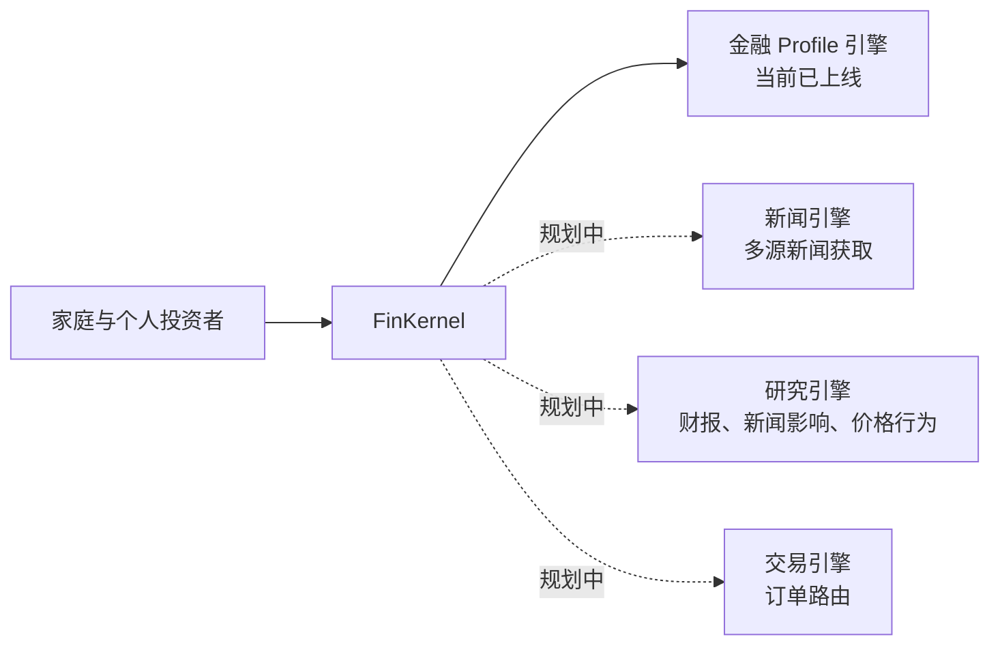
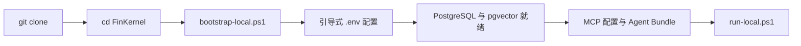

# FinKernel

[](README.en.md)
[](README.zh-CN.md)


FinKernel 是一个 AI-native 的金融基础设施项目，目标是把 family office 级别的工作流能力，降低门槛后带给每一个家庭和每一个普通用户。

今天，大多数 family office 能力仍然被高资金门槛、碎片化工具和大量人工协同所限制。FinKernel 希望把金融上下文、分析能力和执行基础设施，变成一个更适合开发者和 agent 集成的 kernel。

## 背景

传统 family office 服务通常只面向高净值或超高净值人群，这意味着大部分家庭只能使用割裂的数据来源、通用化建议，以及缺少上下文的决策支持。

FinKernel 的出发点不同：

- AI 应该更可靠地获取金融上下文
- 金融工具应该更容易被集成为一个统一系统
- 高质量的金融工作流不应该只属于极少数高门槛用户

我们的目标，是让现代 family office 的能力逐步普惠到每一个家庭和每一个普通投资者。

## 使命

FinKernel 致力于集成各类金融工具，让 AI 系统可以：

- 在正确的时机获取正确的信息
- 在结构化上下文之上形成更好的建议，而不是停留在泛化聊天
- 用更清晰的研究、记忆和流程辅助人类决策

长期来看，FinKernel 不只是一个“金融聊天接口”，而是一个面向 AI 的金融理解、建议辅助与未来执行能力的可组合操作层。

## 平台图谱



## Coverage

整个项目愿景覆盖多个大框架层，但当前主路径里只有金融 profile 建立已经真正落地。

| 框架 | 作用 | 典型输出 | 状态 |
| --- | --- | --- | --- |
| Financial Profile Engine | 建立持久化的投资 persona，包括风险偏好、约束、记忆和 markdown 画像 | `assess_persona`、risk summary、版本化 persona 更新 |  |
| News Engine | 从多类金融源采集和归一化新闻，供 AI 检索使用 | 市场事件聚合、来源感知摘要、跟踪列表 |  |
| Research Engine | 分析财报、新闻影响和价格行为 | 报告解读、事件影响分析、叙事与信号综合 |  |
| Trading Engine | 对接券商与执行层，进行交易订单路由 | 订单路由、审批流、执行辅助 |  |

### 当前交付范围

Phase 1 的重点是先把个人风险画像基础打稳。

在当前代码库里，FinKernel 主要聚焦：

- profile onboarding
- guided risk-profile discovery
- profile review and versioning
- persona markdown authoring
- long-term and short-term memory capture
- MCP + HTTP access for host agents

除此之外的能力目前都应当被视为 roadmap，而不是已经完整交付的产品面。

## 安装方法

### 最快路径

```powershell
git clone https://github.com/JiwenS/FinKernel.git
cd FinKernel
powershell -ExecutionPolicy Bypass -File .\scripts\bootstrap-local.ps1
```

这个 bootstrap 流程的目标不是只跑一个脚本，而是像一个引导式安装器。它会：

- 创建 `.venv`
- 安装依赖
- 一项一项引导 `.env` 配置
- 初始化 PostgreSQL 并启用 `vector`
- 生成本地 MCP 配置
- 准备 host-agent bundle
- 支持自动注册 Codex
- 支持用户选择 agent 侧资源的安装目录

### 如何把项目真正跑起来

```powershell
powershell -ExecutionPolicy Bypass -File .\scripts\run-local.ps1
```

健康检查：

```text
GET http://localhost:8000/api/health
```

MCP 入口：

```text
http://localhost:8000/api/mcp/
```

### 启动流程图



更详细的安装与集成说明见：

- `../setup-and-run.md`
- `../host-agent-runtime-integration.md`
- `../../config/host-agent-mcp-http.example.json`
- `../../config/host-agent-mcp-stdio.example.json`

## 使用方法

### 主要 skill 与 prompt 资产

| 资产 | 作用 |
| --- | --- |
| `../../SKILL.md` | Host agent 的顶层 skill，用于把 profile-aware 对话路由到 FinKernel |
| `../../prompts/persona_assessment.md` | 根据 `assess_persona` 返回状态选择不同用户提示模板 |
| `../../prompts/finkernel_system_routing.md` | 系统级 routing policy，确保 agent 在给泛化金融建议前先读取 profile context |

### 核心 MCP 工具

| 工具 | 作用 |
| --- | --- |
| `assess_persona` | persona add/update 流程的单入口编排工具 |
| `get_profile_onboarding_status` | 检查当前是否存在可用的 active profile |
| `get_profile` | 读取结构化 persona profile |
| `get_profile_persona_markdown` | 读取 human-readable persona artifact |
| `get_profile_persona_sources` | 读取 persona 背后的 evidence、memory 和 contextual rules |
| `get_risk_profile_summary` | 返回紧凑版风险画像摘要，供下游建议使用 |
| `save_profile_persona_markdown` | 保存或刷新 persona markdown |
| `review_profile` | 基于新证据启动 profile review/update |
| `append_profile_memory` | 新增 long-term 或 short-term memory |
| `search_profile_memory` | 按当前对话检索相关记忆 |
| `distill_profile_memory` | 为 agent 压缩出 memory summary |

### 底层 discovery 工具

| 工具 | 作用 |
| --- | --- |
| `start_profile_discovery` | 在不走单入口编排时，手动启动 discovery |
| `get_next_profile_question` | 获取下一个 discovery 问题 |
| `submit_profile_discovery_answer` | 提交 discovery session 的答案 |
| `generate_profile_draft` | 从完成的 session 生成可确认 draft |
| `confirm_profile_draft` | 在 persona markdown 准备好后确认 profile 版本 |
| `list_profiles` | 列出当前存储的 profile |
| `list_profile_versions` | 查看单个 profile 的版本历史 |

### 推荐使用顺序

1. 对于 profile-aware 的投资请求，先调用 `get_profile_onboarding_status`
2. 对 persona 创建、续接或定向更新，统一走 `assess_persona`
3. 在给建议前读取 `get_profile`、`get_profile_persona_markdown` 和 `get_risk_profile_summary`
4. 当用户上下文发生变化时，再使用 review 和 memory 工具

## 建议先读

- `../README.md`
- `../setup-and-run.md`
- `../persona-profiles.md`
- `../persona-agent-workflow.md`
- `../investment-conversation-routing.md`
- `../upper-layer-agent-integration.md`
- `../host-agent-runtime-integration.md`
- `../troubleshooting.md`
- `../../prompts/finkernel_system_routing.md`
- `../../SKILL.md`

## Star History

<a href="https://www.star-history.com/?repos=JiwenS%2FFinKernel&type=date&legend=top-left">
 <picture>
   <source media="(prefers-color-scheme: dark)" srcset="https://api.star-history.com/chart?repos=JiwenS/FinKernel&type=date&theme=dark&legend=top-left" />
   <source media="(prefers-color-scheme: light)" srcset="https://api.star-history.com/chart?repos=JiwenS/FinKernel&type=date&legend=top-left" />
   
 </picture>
</a>
