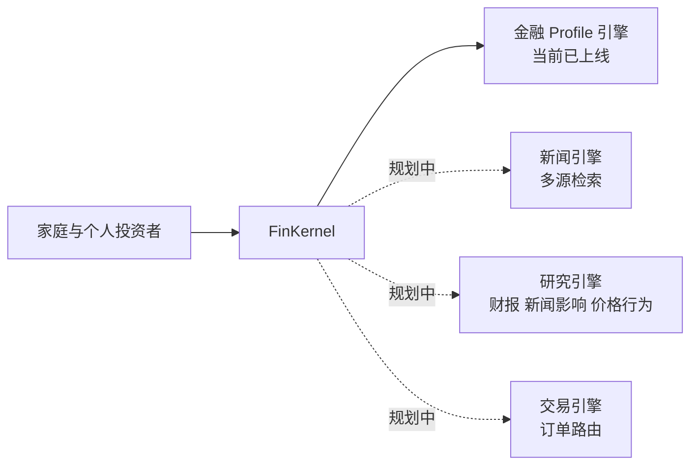
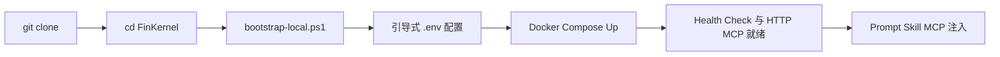

# FinKernel

[](README.en.md)
[](README.zh-CN.md)


FinKernel 是一个面向 AI 的金融基础设施项目，目标是把原本只有 family office 才能享受的工作流能力，逐步普惠给每一个家庭和每一个普通投资者。

今天，大多数 family office 能力仍然被高资产门槛、割裂的工具链和大量人工协同所限制。FinKernel 希望把金融上下文、分析能力和执行基础设施，变成更适合开发者与 agent 集成的 kernel。

## 背景

传统 family office 服务通常只面向高净值或超高净值人群，这意味着绝大多数家庭只能依赖分散的数据来源、泛化建议，以及缺少上下文的决策支持。

FinKernel 的出发点不一样：

- AI 应该能够更可靠地获取金融上下文
- 金融工具应该更容易被集成为一套统一系统
- 高质量的金融工作流不应该只属于少数高门槛用户

我们希望让现代 family office 的能力，逐步对每一个家庭和每一个普通用户开放。

## 使命

FinKernel 致力于集成各类金融工具，让 AI 系统可以：

- 在正确的时机拿到正确的信息
- 基于结构化上下文形成更好的建议，而不是停留在泛化聊天
- 用更清晰的研究、记忆与流程来辅助人类决策

长期来看，FinKernel 不只是一个“金融聊天接口”，而是一个面向 AI 的金融理解、建议辅助与未来执行能力的可组合操作层。

## 平台框架图



## Coverage

整个产品愿景覆盖多个大框架层，但当前主路径里真正上线的只有金融 profile 引擎。

| 框架 | 作用 | 典型输出 | 状态 |
| --- | --- | --- | --- |
| Financial Profile Engine | 建立持续演化的投资 persona，包含风险偏好、约束、记忆与可读 markdown | `assess_persona`、risk summary、版本化 persona 更新 |  |
| News Engine | 从多类金融来源采集并标准化新闻，供 AI 检索使用 | 市场事件聚合、来源感知摘要、观察列表 |  |
| Research Engine | 分析财报、新闻影响与价格行为 | 报告解读、事件影响分析、叙事与信号综合 |  |
| Trading Engine | 对接券商与执行层，处理交易订单路由 | 订单路由、审批流、执行辅助 |  |

### 当前交付范围

Phase 1 的重点是先把 personal risk profile 这层地基打稳。

当前代码库已经覆盖：

- profile onboarding
- guided risk-profile discovery
- profile review and versioning
- persona markdown authoring
- long-term 和 short-term memory capture
- 面向 host agents 的 MCP + HTTP 接入

其余能力目前都仍然属于 roadmap，不应该被表述成已经完整交付。

## 安装

### 官方本地安装路径

FinKernel v1 当前只支持一种官方本地安装方式：

- 仅支持 Docker

### 最快路径

```powershell
git clone https://github.com/JiwenS/FinKernel.git
cd FinKernel
powershell -ExecutionPolicy Bypass -File .\scripts\bootstrap-local.ps1
```

这个 bootstrap 流程的目标不是“只是跑一个脚本”，而是像一个引导式安装器。它会：

- 逐项引导 `.env` 配置
- 确保 `config/persona-profiles.json` 会以空白本地 profile 存储文件的形式生成
- 用 Docker 启动 FinKernel 与带 pgvector 的 PostgreSQL
- 等待 HTTP app 和 MCP endpoint 变为可用
- 生成本地 HTTP MCP 配置
- 优先支持四个一等公民 host agent：`Codex`、`Claude Code`、`OpenClaw`、`Hermes`
- 把 FinKernel skill bundle 安装到对应 agent 的原生 skills 目录
- 在检测到对应 CLI 时自动尝试完成 HTTP MCP 注册
- 对其他宿主保留 `Custom MCP client` 导出路径

### 后续再次启动项目

首次 bootstrap 完成后，可以用下面的命令重新拉起 Docker stack：

```powershell
powershell -ExecutionPolicy Bypass -File .\scripts\run-local.ps1
```

健康检查：

```text
GET http://localhost:8000/api/health
```

MCP 地址：

```text
http://localhost:8000/api/mcp/
```

如果你在 `.env` 中修改了 `APP_PORT`，请把上面的 `8000` 换成你自己的端口。

### 卸载

如果你要移除 FinKernel 的 Docker stack、本地生成文件，以及已经安装到各类 agent 里的 FinKernel bundle，可以运行：

```powershell
powershell -ExecutionPolicy Bypass -File .\scripts\uninstall-local.ps1
```

### 启动流程图



更详细的安装与集成说明见：

- `../setup-and-run.md`
- `../host-agent-runtime-integration.md`
- `../../config/host-agent-mcp-http.example.json`

## 使用方式

### 主要 skill 与 prompt 资产

| 资产 | 作用 |
| --- | --- |
| `../../SKILL.md` | Host agent 的顶层 skill，用来把 profile-aware 对话路由到 FinKernel |
| `../../prompts/persona_assessment.md` | 基于 `assess_persona` 状态返回的 prompt 模板 |
| `../../prompts/finkernel_system_routing.md` | 系统级 routing policy，确保 agent 在给泛化建议前先读取 profile context |

### 一等公民 agent

| Agent | 快速配置方式 |
| --- | --- |
| `Codex` | 安装到 `~/.codex/skills/finkernel-profile`，并尝试执行 `codex mcp add` |
| `Claude Code` | 安装到 `~/.claude/skills/finkernel-profile`，并尝试执行 `claude mcp add --transport http --scope local` |
| `OpenClaw` | 安装到 `~/.openclaw/skills/finkernel-profile`，并尝试通过 `openclaw mcp set` 写入 `streamable-http` MCP 配置 |
| `Hermes` | 安装到 `~/.hermes/skills/finkernel-profile`，并尝试执行 `hermes config set mcp_servers.finkernel.url` |
| `Custom MCP client` | 手动使用导出的 `host-agent-mcp-http.json` bundle 文件 |

### 核心 MCP 工具

| 工具 | 作用 |
| --- | --- |
| `assess_persona` | persona add/update 的单入口编排工具 |
| `get_profile_onboarding_status` | 检查当前是否存在可用的 active profile |
| `get_profile` | 读取结构化 persona profile |
| `get_profile_persona_markdown` | 读取可读版 persona artifact |
| `get_profile_persona_sources` | 读取 persona 背后的 evidence、memory 与 rules |
| `get_risk_profile_summary` | 返回压缩版风险画像摘要，供下游建议使用 |
| `save_profile_persona_markdown` | 保存或刷新 persona markdown |
| `review_profile` | 基于新证据启动 profile review/update |
| `append_profile_memory` | 追加 long-term 或 short-term memory |
| `search_profile_memory` | 检索与当前对话相关的 profile memory |
| `distill_profile_memory` | 为 agent 生成压缩后的 memory summary |

### 底层 discovery 工具

| 工具 | 作用 |
| --- | --- |
| `start_profile_discovery` | 不走单入口编排时，手动启动 discovery |
| `get_next_profile_question` | 获取下一个 discovery 问题 |
| `submit_profile_discovery_answer` | 提交 discovery session 的回答 |
| `generate_profile_draft` | 从完成的 session 生成可确认 draft |
| `confirm_profile_draft` | 在 persona markdown 就绪后确认 profile 版本 |
| `list_profiles` | 列出 profile |
| `list_profile_versions` | 查看单个 profile 的版本历史 |

### 推荐 host 流程

1. 对于 profile-aware 的投资请求，先调用 `get_profile_onboarding_status`。
2. 对 persona 的创建、续做或定向更新，统一使用 `assess_persona`。
3. 在给建议前，先读取 `get_profile`、`get_profile_persona_markdown` 和 `get_risk_profile_summary`。
4. 当用户的新信息改变上下文时，再使用 review 与 memory 工具。

## 建议先读

- `../README.md`
- `../setup-and-run.md`
- `../persona-profiles.md`
- `../persona-agent-workflow.md`
- `../investment-conversation-routing.md`
- `../upper-layer-agent-integration.md`
- `../host-agent-runtime-integration.md`
- `../troubleshooting.md`
- `../../prompts/finkernel_system_routing.md`
- `../../SKILL.md`

## Star History

<a href="https://www.star-history.com/?repos=JiwenS%2FFinKernel&type=date&legend=top-left">
 <picture>
   <source media="(prefers-color-scheme: dark)" srcset="https://api.star-history.com/chart?repos=JiwenS/FinKernel&type=date&theme=dark&legend=top-left" />
   <source media="(prefers-color-scheme: light)" srcset="https://api.star-history.com/chart?repos=JiwenS/FinKernel&type=date&legend=top-left" />
   
 </picture>
</a>
